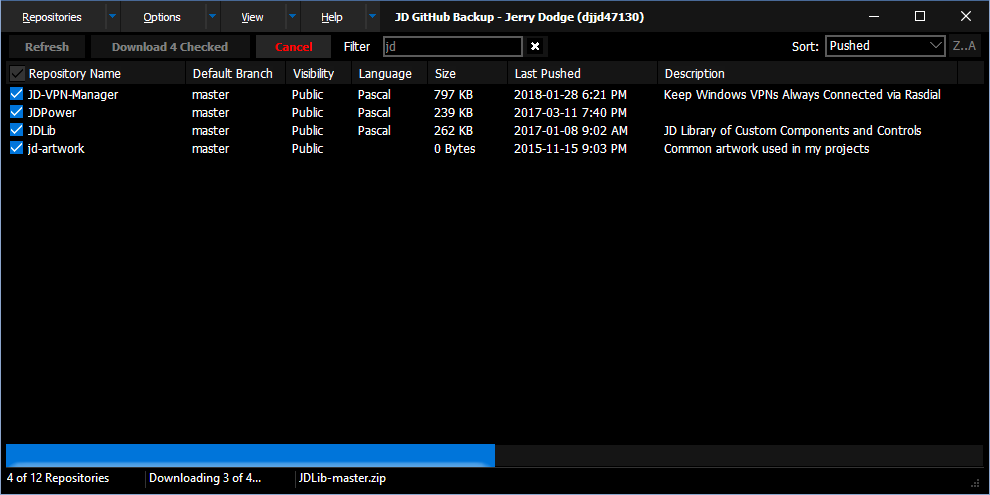

# JD GitHub Backup Application
Simple UI for bulk downloading GitHub repositories

## Download the Latest Version

[Click here](https://github.com/djjd47130/GitHubBackup/releases) to download the latest release.

## Summary

This project allows for a very simple download of multiple repositories at once from any given user or organization. Simply fetch a list of all repositories, place a check by the ones you want, and click "Download" to get them all at once.

## Background

This project came to be due to a lack of user-friendly solutions to back up GitHub repositories in bulk. While there are some solutions, most of them were highly scripted, and none of them were viable solutions for the immediate purpose: to allow anybody to bulk-download multiple repositories as a form of "backup". 

## Setup

To use this tool, you will need to first obtain a personal access token for your GitHub account if you wish to access any private repositories. By default, with no token, you will have public access. You will also need to select a directory where you want your repositories downloaded to, as well as enter the account name of the user or organization you need to work with.

### Obtaining Access Token

You can create your own personal access token by visiting your [Developer Settings](https://github.com/settings/tokens). Enter this token into the "Access Token" field in the app's setup screen. 

### Account Name

This app supports either user accounts or organization accounts. Enter the unique account name into the setup, and then choose whether it's a `User` or an `Organization`. 

### Backup Directory

You need to choose the folder on your local computer where you want to download your repositories to. Either type that directory into the "Backup Directory" field, or click the browse button to the right of it. The app will validate the directory you choose before allowing you to continue.

## Listing Repositories

The main screen allows you to fetch a list of all the repositories the chosen access token allows you to see in the chosen account. It describes various attributes about each repository. 

### Important Note

The "Size" of the repositories is not accurate. At this time, it's unknown exactly how GitHub calculates this size, but it does not appear to account for binary files (which consume a majority of space). In the screenshot above, you can see a repository `jd-artwork` which is actually the largest Repo I have - but it reports a size of `0`.

## Downloading Repositories

To the left of each list item, you can place a check next to each repository you wish to download, or you can select all. By clicking the main "Download" button, you initiate the bulk download of all the checked repositories. Any errors which occur during download will be reported in an error log at the bottom of the screen. 

### Progress Indicator

The progress is purely based on number of repositories downloaded versus total number to download. It does not account for repo size, simply because the size is not reliable data. 

Either way, the progress is also shown in the taskbar icon for the application.

### Rate Limiting

GitHub [restricts the number of API calls](https://developer.github.com/v3/#rate-limiting) that can be used in a given period of time. At the time of writing this, authenticated users (with token) have a limit of 5,000 requests per hour, while unauthenticated users (anonymous without token) have a limit of 60 requests per hour. Note that due to pagination, a single "refresh" of repositories may end up in multiple API calls, depending on page size and number of repositories being fetched. This also applies to repository detail, such as branches and commits, also using pagination.

## Technical / Requirements

### Delphi

This app was originally written in Delphi 10.0 Seattle but later revised in Delphi 10.1 Berlin. It has not been tested in any other Delphi versions, but it's anticipated to make this library work on multiple Delphi versions. Theoretically, it *should* work back to Delphi XE3, when VCL Styles were introduced. 

### Vcl Styles Utils

This project makes use of the [Vcl Styles Utils](https://github.com/RRUZ/vcl-styles-utils), which contains many fixes for the styling system in Delphi's VCL framework. It's also used for the main menu across the non-client title bar on the top. This library is not included in this repository, so you will need to obtain this library separately.

### X-SuperObject

This project makes use of the [X-SuperObject](https://github.com/onryldz/x-superobject) JSON serialization library. It contains its own copy of these files, and must be noted that while these files are part of this project, they were not written by me. This is because the library is minimal, and I've made some customizations to it.

### Virtual TreeView

This project makes use of the [Virtual Treeview](https://github.com/Virtual-TreeView/Virtual-TreeView). While it is not yet implemented, you don't need to download/install the library. However future versions will migrate to this component. 

### JDLib

This project makes use of another project of mine [JDLib](https://github.com/djjd47130/JDLib) which contains some of my common-purpose works. Specifically, font glyphs using Font Awesome. You will need to install it first in order to open this project.

### FontAwesome

The JDLib makes use of [FontAwesome](https://fontawesome.com) for glyph icons. The Vcl-Styles-Utils automatically includes this in the project and is unnecessary to install/distribute.

### OpenSSL

This project requires the OpenSSL binaries in Indy. These are not included in this repository, and you are responsible to provide a 32bit set of binaries with the output executable. Specifically, `ssleay32.dll` and `libeay32.dll`. However, the binary downloads in the releases section does include these files. 

### Inno Setup Installer

This project includes an installer script for [Inno Setup](http://www.jrsoftware.org/isinfo.php), written in version 5.5.9 (u). It is very simple, and the script has not been modified at all since being auto-generated by the Inno Setup wizard, besides the version number.

### WinCHM Help File

This project includes a CHM (HTML) help file written in [WinCHM](http://www.softany.com/winchm/) v4.48. This file is to be updated regularly upon any UI or logic changes in the actual project. Help should reflect the software at any given time. 
