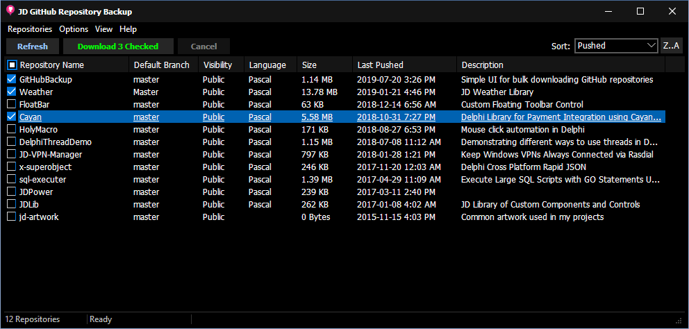

# GitHub Backup Application
Simple UI for bulk downloading GitHub repositories

## IMPORTANT NOTE

This project is currently under active development, and is not a complete solution yet. It is however fully functional in its current state for what it needs to do. There are many improvements which are being worked on at this time, and the internal structure will undergo complete revisions.

## V2 Branch

There is a separate `V2` branch where new features are being implemented. This will serve as a replacement in the future, once it's become stable. V2 will consist of a wrapper library and feature-rich grid view. 

## Summary

This project allows for a very simple download of multiple repositories at once from any given user or organization. Simply fetch a list of all repositories, place a check by the ones you want, and click "Download" to get them all at once.

## Background

This project came to be due to a lack of user-friendly solutions to back up GitHub repositories in bulk. While there are some solutions, most of them were highly scripted, and none of them were viable solutions for the immediate purpose: to allow anybody to bulk-download multiple repositories as a form of "backup". 

## Delphi Version

This app was originally written in Delphi 10.0 Seattle but later revised in Delphi 10.1 Berlin. It has not been tested in any other Delphi versions, but it's anticipated to make this library work on multiple Delphi versions. 

## Inno Setup

This project includes an installer script for Inno Setup, written in version 5.5.9 (u). It is very simple, and the script has not been modified at all since being auto-generated by the Inno Setup wizard. 

## Vcl Styles Utils

This project makes use of the Vcl Styles Utils, which contains many fixes for the styling system in Delphi's VCL framework. More specifically, the Windows open/save dialogs. You can enable/disable the `USE_VCL_STYLE_UTILS` conditional in the project's settings depending on whether you wish to implement it.

## X-SuperObject

This project makes use of the X-SuperObject JSON serialization library. It contains its own copy of these files, and must be noted that while these files are part of this project, they were not written by me. 

## OpenSSL

This project requires the OpenSSL binaries. These are not included in this repository, and you are responsible to provide a 32bit set of binaries with the output executable. Specifically, `ssleay32.dll` and `libeay32.dll`. However, the binary downloads in the releases section does include these files. 

## Setup

To use this tool, you will need to first obtain a personal access token for your GitHub account. When first opening the application, you will be required to enter this token in the setup. You will also need to select a directory where you want your repositories downloaded to, as well as enter the account name of the user or organization you need to work with.

### Obtaining Access Token

You can create your own personal access token by visiting your [Developer Settings](https://github.com/settings/tokens). Enter this token into the "Access Token" field in the app's setup screen. 

### Account Name

This app supports either user accounts or organization accounts. Enter the unique account name into the setup, and then choose whether it's a `User` or an `Organization`. 

### Backup Directory

You need to choose the folder on your local computer where you want to download your repositories to. Either type that directory into the "Backup Directory" field, or click the browse button to the right of it. The app will validate the directory you choose before allowing you to continue.

## Listing Repositories

The main screen allows you to fetch a list of all the repositories the chosen access token allows you to see in the chosen account. It describes various attributes about each repository. 

### Important Note

The "Size" of the repositories is not accurate. At this time, it's unknown exactly how GitHub calculates this size, but it does not appear to account for binary files (which consume a majority of space). In the screenshot above, you can see a repository `jd-artwork` which is actually the largest Repo I have - but it reports a size of `0`.

## Downloading Repositories

To the left of each list item, you can place a check next to each repository you wish to download, or you can select all. By clicking the main "Download" button, you initiate the bulk download of all the checked repositories. 

### Progress Indicator

The progress is purely based on number of repositories downloaded versus total number to download. It does not account for repo size, simply because the size is not reliable data. 

Either way, the progress is also shown in the taskbar icon for the application.
